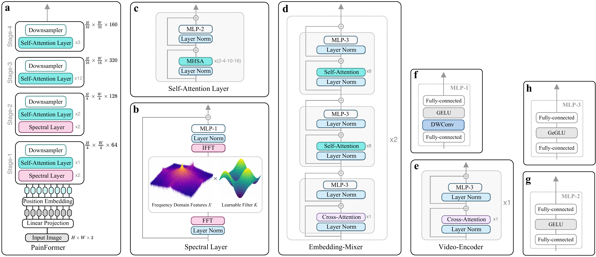

# PainFormer

A Vision Foundation Model for Affective Computing

> **PainFormer** · **19.60 M parameters** · **5.82 GFLOPs** · **160-D embeddings** · **PyTorch ≥ 2.0**

---

## Paper

[**PainFormer: A Vision Foundation Model for Automatic Pain Assessment**](https://arxiv.org/abs/XXXX.XXXXX)

---

## Highlights

| Feature                | Description                                               |
| ---------------------- | --------------------------------------------------------- |
| **Pre-training scale** | Multi-task pre-training on **14 tasks / 10.9 M samples**. |
| **Parameters**         | **19.60 M** (PainFormer encoder).                         |
| **Compute**            | **5.82 GFLOPs** at 224×224 input.                         |
| **Embeddings**         | Fixed **160-D** output vectors.                           |

<br/>

<p align="center">
  
</p>

<p align="center"><b>Figure&nbsp;1.</b> PainFormer overview.</p>

<p align="center">
  
</p>

<p align="center"><b>Figure&nbsp;2.</b> PainFormer architecture.</p>

---

## Table of Contents

1. [Pre-trained checkpoint](#pre-trained-checkpoint)  
2. [Quick start](#quick-start)  
   * [Extract embeddings](#extract-embeddings)  
3. [Fine-tuning](#fine-tuning)  
4. [Citation](#citation)  
5. [Licence & acknowledgements](#licence--acknowledgements)  
6. [Contact](#contact)  

---

## Pre-trained checkpoint

Get the weights from the **[GitHub Releases](https://github.com/GkikasStefanos/PainFormer/releases)**.

| File             | Size    |
| ---------------- | ------- |
| `painformer.pth` | **TBA** |

```bash
# download the latest checkpoint
auto=https://github.com/GkikasStefanos/PainFormer/releases/latest/download/painformer.pth
curl -L -o painformer.pth "$auto"

# optional: verify
sha256sum painformer.pth
````

The checkpoint contains **one key**:

```text
model_state_dict    # PainFormer backbone weights
```

---

## Quick start

> Assumes **PyTorch ≥ 2.0** and **timm ≥ 0.9** are installed.

### Extract embeddings

```python
import torch
from timm.models import create_model
from architecture import painformer
from PIL import Image
from torchvision import transforms

# ---------------------------------------------------------------
# Setup ---------------------------------------------------------
# ---------------------------------------------------------------
device = "cuda"

# VGG-Face2 stats used in our experiments
normalize = transforms.Normalize(
    mean=[0.6068, 0.4517, 0.3800],
    std=[0.2492, 0.2173, 0.2082]
)
to_tensor = transforms.Compose([
    transforms.Resize((224, 224)),
    transforms.ToTensor(),
    normalize
])

# ---------------------------------------------------------------
# Load PainFormer -----------------------------------------------
# ---------------------------------------------------------------
model = create_model('painformer').to(device)
state = torch.load('./checkpoints/painformer.pth', map_location=device)
model.load_state_dict(state['model_state_dict'], strict=False)

# expose embeddings (remove classification head)
model.head = torch.nn.Identity()
model.eval()

# ---------------------------------------------------------------
# One image → 160-D embedding -----------------------------------
# ---------------------------------------------------------------
img = Image.open('frame.png').convert('RGB')
x = to_tensor(img).unsqueeze(0).to(device)  # [1, 3, 224, 224]

with torch.no_grad():
    emb = model(x)        # [1, 160]
    emb = emb.squeeze(0)  # [160]

print("Embedding shape:", tuple(emb.shape))  # (160,)
```

---

## Fine-tuning

Add your own classification/regression head and (optionally) un-freeze the backbone:

```python
import torch, torch.nn as nn
from timm.models import create_model
from architecture import painformer

# ---------------------------------------------------------------
# Setup ----------------------------------------------------------
# ---------------------------------------------------------------
device = "cuda"
num_classes = 3  # set to your task

# Backbone → 160-D embeddings
model = create_model('painformer').to(device)
state = torch.load('painformer.pth', map_location=device)
model.load_state_dict(state['model_state_dict'], strict=False)

# freeze if you only need fixed embeddings
for p in model.parameters():
    p.requires_grad = False

# simple head (example)
head = nn.Sequential(
    nn.ELU(),
    nn.Linear(160, num_classes)
).to(device)

optimizer = torch.optim.Adam(head.parameters(), lr=1e-3)
criterion = nn.CrossEntropyLoss()

# one step (sketch)
def step(x, y):
    model.eval()
    with torch.no_grad():
        z = model(x)      # [B, 160]
    logits = head(z)      # [B, C]
    loss = criterion(logits, y)
    return loss, logits

# --- optional: end-to-end fine-tune ---
for p in model.parameters():
    p.requires_grad = True
optimizer = torch.optim.AdamW(
    list(model.parameters()) + list(head.parameters()),
    lr=3e-4, weight_decay=0.05
)
```

---

## Citation

```bibtex
@article{gkikas2025painformer,
  title   = {PainFormer: A Vision Foundation Model for Automatic Pain Assessment},
  author  = {Gkikas, Stefanos and Rojas, Raul Fernandez and Tsiknakis, Manolis},
  journal = {to appear},
  year    = {2025}
}
```

---

## Licence & acknowledgements

* Code & weights: **MIT Licence** – see [`LICENSE`](./LICENSE)

---

## Contact

Email **Stefanos Gkikas** ([gkikas@ics.forth.gr](mailto:gkikas@ics.forth.gr)).
